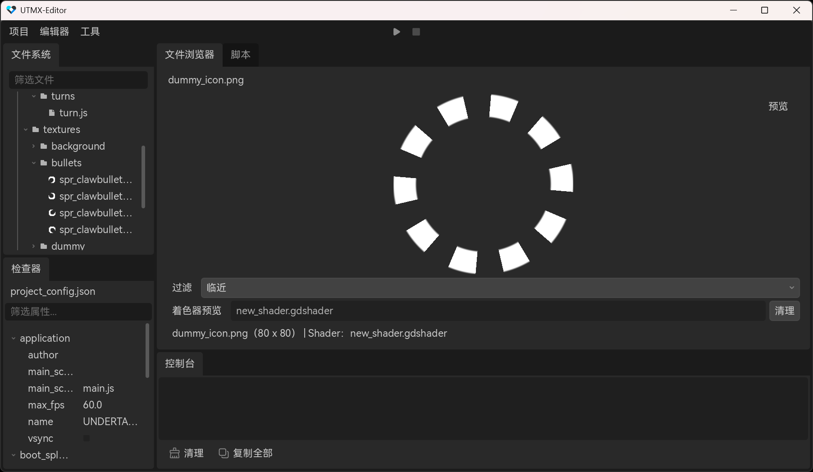

# 编写着色器

UTMX 的着色器实际上是 GodotShader，可以在 [Godot Shader](https://godotshaders.com/) 中找到非常多有趣的案例。

当完成着色器后，你可以导入一张纹理（任意纹理都可以），然后在预览精灵的面板中，从文件系统拖拽着色器到底部的着色器条目。

<br />




## 使用示例

### 静态加载着色器代码

该示例展示了如何在一个 Sprite 中应用着色器。

```javascript
import { UTMX } from "UTMX";

let sprite = UTMX.Sprite.new();
sprite.textures = "textures/logo.png";
sprite.shader = new UTMX.Shader("shaders/my-custom-shader.gdshader");;
```

---

### 动态编译着色器代码

该示例展示了如何在一个 DrawableObject 中加载并应用着色器，实现屏幕着色器负片效果。

```javascript
import { UTMX } from "UTMX";

let shader = new UTMX.Shader();
shader.shaderCode = `
shader_type canvas_item;

uniform sampler2D SCREEN_TEXTURE : hint_screen_texture;

void fragment() {
    vec4 col = texture(SCREEN_TEXTURE, SCREEN_UV);

    col.rgb = 1.0 - col.rgb;

    COLOR = col;
}
`;

let drawableObject = UTMX.DrawableObject.new();
drawableObject.shader = shader;
drawableObject.z = 4096;
drawableObject.drawRect(new Vector2(0, 0), new Vector2(640,  480));
```