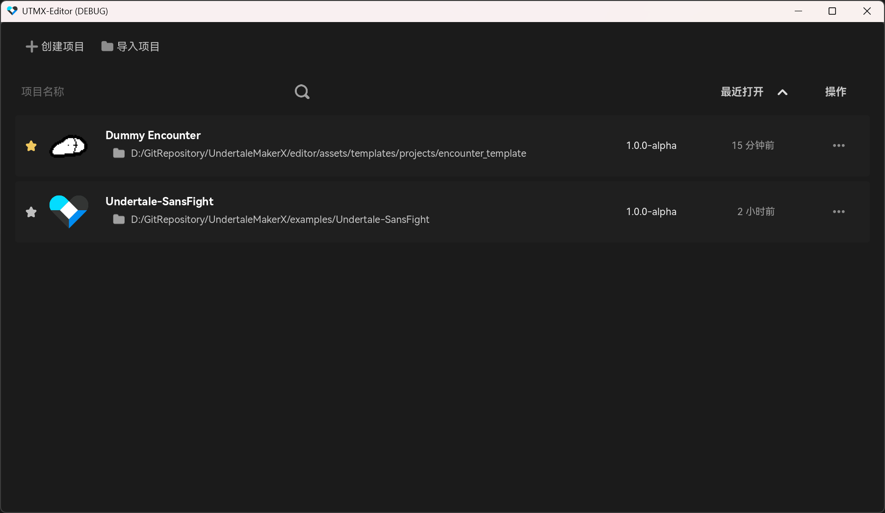
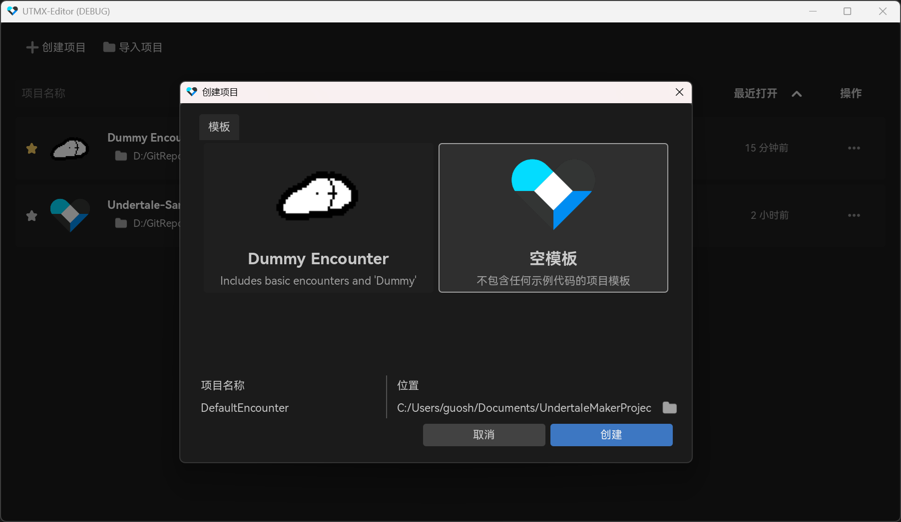
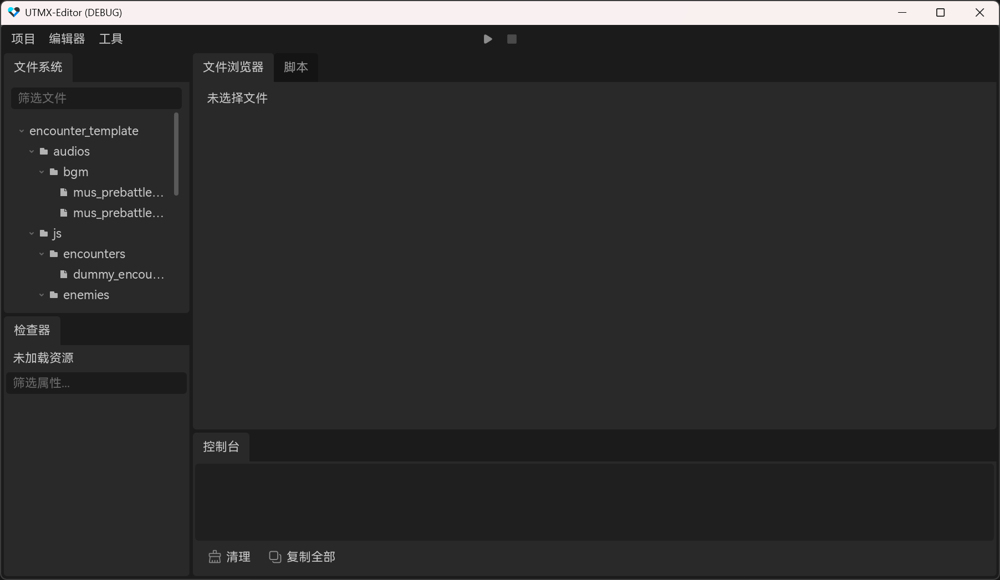

# 编辑器介绍

本页主要介绍 UndertaleMakerX 的编辑器页面。

## 项目管理器

启动编辑器后，你会看到项目管理器页面，你可以管理本地拥有的项目。

> 默认的项目位置在操作系统文档的目录中的 `UndertaleMakerProject` 中，根据操作系统不同而有所不同。

### 创建与导入项目

点击编辑器左上角的 **创建项目** 按钮，就会弹出创建项目窗口。

你可以选择 UTMX 提供的模板，按照模板创建你的初始项目。

其中:
- Dummuy Encounter 包含一个基础的战斗框架（敌人/遭遇）。
- Empty Template 不包含任何代码。

点击编辑器左上角的 **导入项目** 按钮，会弹出文件系统对话框，提示你导入一个有效的 `utmx.cfg` 文件。（目前还不支持从ZIP导入项目）。

 

## 项目的启动

创建项目后，新项目会显示在项目管理器面板中，双击打开它，就会进入项目编辑器页面。

编辑器默认布局的左上角面板是编辑器的文件系统，你可以在此浏览项目饱和的资源，以及其他文件。

默认布局的左下角面板是编辑器的属性检查器，支持编辑 `json` 与 `ini` 格式的文件。

而右侧是编辑器工作区，分为 `文件浏览器` 和 `脚本编辑器`。

文件浏览器支持预览 `图片/着色器`，`音频`，`字体` 等资源。
脚本编辑器支持预览并编辑 `非二进制文件`。

## 运行项目

点击编辑器上方的 `运行` 按钮，编辑器会在有效路径寻找对应操作系统平台的 `runner` 可执行文件。

你可以在 UTMX 的 [Github发布页](https://github.com/Yanxiyimengya/UndertaleMakerX/releases/) 找到对应运行时可执行文件。

### 安装运行时

编辑器发布时默认会附带运行时文件，但若文件丢失，你可以再编辑器可执行文件的根目录下，创建或找到 `runner/` 文件夹，将对应平台的运行时文件放置在此文件夹下即可。

