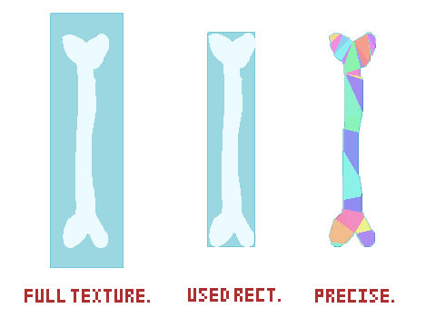

# BattleProjectile

继承 [Sprite](types/game-object/sprite.md)

BattleProjectile 表示战斗中的射弹对象，在战斗中检测与玩家灵魂之间发生的碰撞，并对玩家造成伤害，也可以互相检查碰撞。

通过 `UTMX.BattleProjectile` 访问

## 常量（Constants）

### ProjectileCollisionMode

碰撞模式决定如何构建射弹的碰撞盒。

> PRECISE 模式无法处理空心的多边形。

| Property | Type   | Default | Description |
| -------- | ------ | ------- | ----------- |
| FULL_TEXTURE   | number | 0       | 按照整张纹理的大小构建碰撞盒 |
| USED_RECT   | number | 1       | 按照纹理实际使用的大小构建碰撞盒 |
| PRECISE   | number | 2       | 按照纹理内容精确构建碰撞盒（慢） |

效果如图所示：



## 核心属性（Properties）

| Property | Type   | Default | Description |
| -------- | ------ | ------- | ----------- |
| damage   | number | 1       | 与玩家灵魂碰撞时对玩家造成的伤害 |
| destroyOnTurnEnd | boolean | true     | 若为 `true` 则当怪物回合结束后自动销毁 |
| collisionMode | UTMX.BattleProjectile.ProjectileCollisionMode | USED_RECT     | 射弹的碰撞模式 |
| preciseEpsilon | number | 1.0     | 若碰撞模式为 `PRECISE`，控制方块算法构建碰撞盒多边形的精度，值越小越精细，同时性能损耗越大，值越大精度越粗糙，性能损耗越小 |
| useMask   | boolean | false       | 决定当前射弹的精灵是否绘制在 Arena 的遮罩中 |
| enabled   | boolean | true       | 决定当前射弹是否启用，若为 `true` 则允许射弹检测一切碰撞 |
| canCollideWithSoul   | boolean | true  | 决定当前射弹是否启用与玩家灵魂之间的碰撞 |
| canCollideWithProjectile   | boolean | false   | 决定当前射弹是否启用与其他射弹之间的碰撞 |

### onHit

这是 BattleProjectile 中的一个特殊内置属性，这个回调函数当检测到与玩家灵魂的碰撞箱碰撞时每帧触发。你可以设置一个无参数的匿名函数用于处理当射弹碰撞到玩家时执行的默认行为，这会覆盖引擎的内置 行为。

> 射弹的 `canCollideWithSoul` 属性需为 `true`

```javascript
onHit() -> void;
```

#### 使用示例

该示例展示了如何通过 [onHit](#onHit)，实现射弹的蓝色攻击类型。当玩家移动时，才会对玩家造成 `this.damage` 点伤害。

```javascript
import { UTMX } from "UTMX";

export default class BlueProjectile extends UTMX.BattleProjectile
{
    start()
    {
        this.damage = 2;
    }

    onHit()
    {
        if (UTMX.battle.soul.isMoving())
        {
            UTMX.player.hurt(this.damage);
        }
    }
}
```

---

### onHitProjectile

onHitProjectile 这个回调函数当检测到与其他 Projectile 碰撞时每帧触发，这个回调函数接受一个参数，表示与之碰撞的射弹。

> 互相碰撞的两个射弹的 `canCollideWithProjectile` 属性都需为 `true`

```javascript
onHitProjectile(projectile: BattleProjectile) -> void;
```
